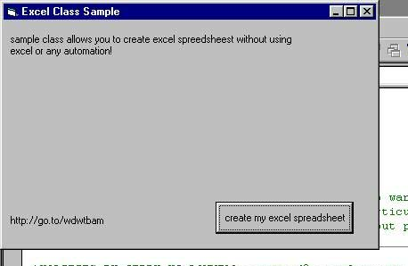



## Create Excel Spreadsheets without Excel

### Description

contains a easy to use excel class so you can create excel spreadsheets with out using excel automation.

it writes the data you to the row,col u want to a .xls file u specify.
 
### More Info
 

             |
---                |---
**Submitted On**   |2001-04-22 22:09:36
**By**             |[irish\_bloke](https://github.com/Planet-Source-Code/PSCIndex/blob/master/ByAuthor/irish-bloke.md)
**Level**          |Intermediate
**User Rating**    |4.6 (37 globes from 8 users)
**Compatibility**  |VB 4\.0 \(16\-bit\), VB 4\.0 \(32\-bit\), VB 5\.0, VB 6\.0, VB Script, ASP \(Active Server Pages\) 
**Category**       |[Microsoft Office Apps/VBA](https://github.com/Planet-Source-Code/PSCIndex/blob/master/ByCategory/microsoft-office-apps-vba__1-42.md)
**World**          |[Visual Basic](https://github.com/Planet-Source-Code/PSCIndex/blob/master/ByWorld/visual-basic.md)
**Archive File**   |[Create Exc187404232001\.zip](https://github.com/Planet-Source-Code/irish-bloke-create-excel-spreadsheets-without-excel__1-22638/archive/master.zip)

